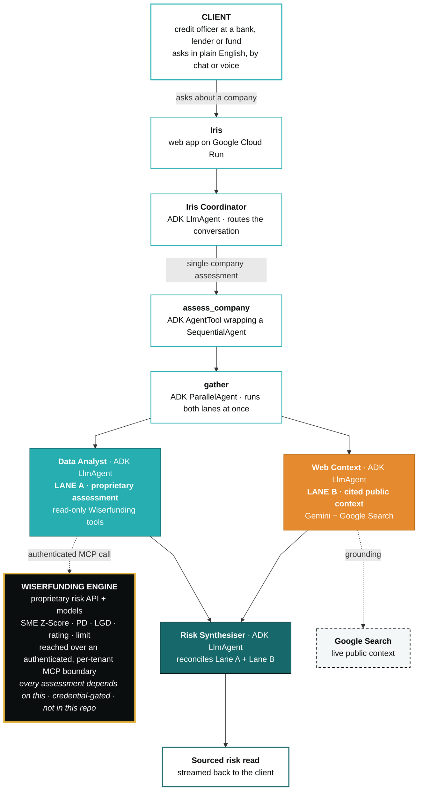
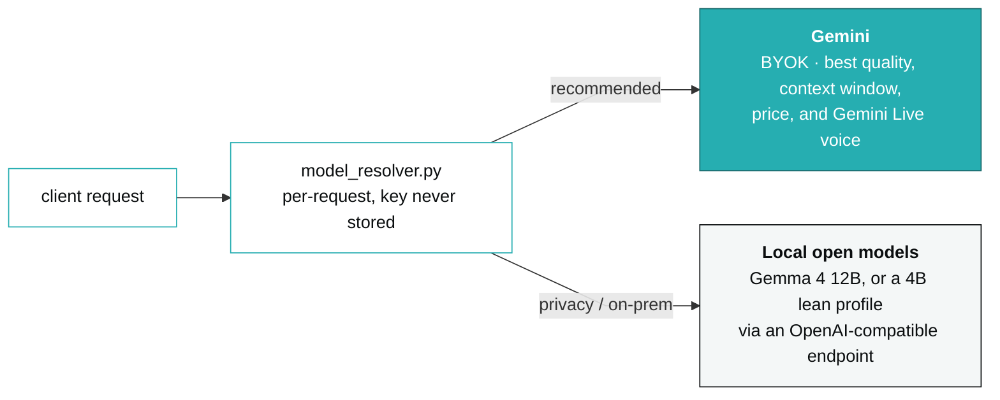

# Iris architecture

Iris is delivered to **Wiserfunding's clients** (banks, lenders, asset managers and credit funds), not used internally. A credit officer at a client institution talks to Iris in plain English, by chat or voice, and Iris autonomously produces a sourced credit-risk read.

The flow runs straight down. The client asks at the top. The ADK coordinator delegates a single-company assessment to a parallel team. Lane A reaches out to the Wiserfunding engine and Lane B to Google Search. A synthesiser reconciles the two, and the finished read streams back to the client at the bottom.

**Everything runs on the Wiserfunding engine.** Lane A's every number comes from Wiserfunding's proprietary risk API, reached over an authenticated, per-tenant MCP boundary. No credential, no assessment. The contest judges get a demo login so they can see it work; in production, only Wiserfunding's paying clients hold a key. That is the point: the agent is the interface, the Wiserfunding engine is the product, and nothing the agent does is possible without it.

*Reading the diagram: the coloured boxes are our ADK agents (teal Lane A, orange Lane B, dark teal synthesiser). The gold-edged black box is the Wiserfunding engine, the proprietary, credential-gated core that every assessment depends on (not in this repo). The dashed box on the right is the external Google Search boundary. Dashed arrows are the agent reaching out to an external service; solid arrows are the assessment flowing down to the client.*

**Why two lanes.** Lane A is Wiserfunding's proprietary, authoritative assessment (the SME Z-Score, PD, LGD, bond-rating equivalent, indicative limit). Lane B is live, cited, public web context. They run in parallel and stay strictly separate, so the proprietary numbers and the public facts never blur. The synthesiser produces a read that neither lane could produce alone, which is the core argument for the multi-agent design.

## The model layer (model-agnostic)

The ADK agents are not tied to one model. Per request, the runtime (`model_resolver.py`) builds the LLM client from the client's choice and discards it:

- **Bring-your-own-key Gemini (recommended).** Clients keep control of cost and data, we never meter or store the key (there is no key column anywhere, it is structural). We recommend Gemini because it gives the best report quality, the largest context window to hold a full assessment, and the strongest quality-for-price. **Gemini Live** powers the voice layer, which is unmatched for a hands-free analyst.
- **Local open models (privacy / on-prem).** For clients with data-residency or privacy constraints, Iris runs entirely on a self-hosted open model with no external key. It is validated on **Gemma 4 (12B)**, and we tuned a **lean profile for 4B-class models** with a lighter system prompt and a read-only tool slice so a small on-box model stays reliable.
- **Custom local endpoint.** A client can point Iris at their own OpenAI-compatible endpoint. This path is guarded by a strict SSRF filter (`validate_base_url`): https-only, the host is resolved and every resolved IP checked against private, loopback, link-local, cloud-metadata and IPv4-mapped-IPv6 ranges before any call.

The two-lane assessment, the guardrails, and the streamed output are identical across models. The model is a swappable backend; the agent design is the product.
